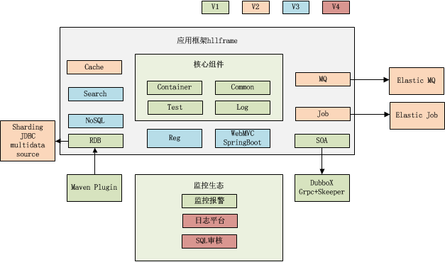

# 码农的足迹

## 代码编写
* [高性能代码](./topics/code.md)
* [代码易读易测](./topics/架构是什么.md)
* [C++网络通信](./topics/C++网络通信.md)

## 从业务到技术

### 技术负债到技术沉淀
- 产品的研发一般都是有目的性的，有时间和人员投入限定的，对应这些的管理一般都是通过是项目开展。
- 在项目的开展过程中涉及的工作的拆分WBS等相关的工作。 很多时候都不会注意代码技术的沉淀，多数是在二次开发的时候进行。
- 这里就涉及到技术负债的问题。
- 解决技术负债将能够很好提示技术深度，同时也可能拓展技术的广度。

### 大数据-系统相关
* 1）hbase - bigtable理论以及代码说明
* 2）hadoop - yarn任务调度管理
* 3）hadoop - mapreduce相关的管理

### 大数据-计算
1. 实时计算
2. 流式计算
3. 离线计算

### 大数据-存储
* 文件存储
	hdfs
	fastdb
* 列式存储
	hbase
	elastic-search
	
* 内存存储

---

> 大量数据的分而治之方法
>> 核心技术hash以及一致性hash算法处理

---

1. tair
2. codis
3. memcache

### 网络通信
1. c++ tcp/udp
2. java netty
3. tcpdump以及windows下的wireshark的分析工具

### 流量调度
#### nginx+lua 相关配置
|ID|技术|详情|
|-|-|-|
| 1  | 流量分发 | 根据groupID进行找对应的处理服务器 |
| 2 | IP地址| 根据IP地址进行路由选择 |

### 分布式架构
#### 微服务与SOA
#### 分布式架构设计
* 隔离设计
* 异步通讯设计
* 幂等性设计
* 服务的状态
* 补偿事务
* 重试设计
* 熔断设计
* 限流设计
* 降级设计

### 分布式架构设计原则

## 从技术到管理

### 敏捷开发管理

### 研发体系建设

something about coder
